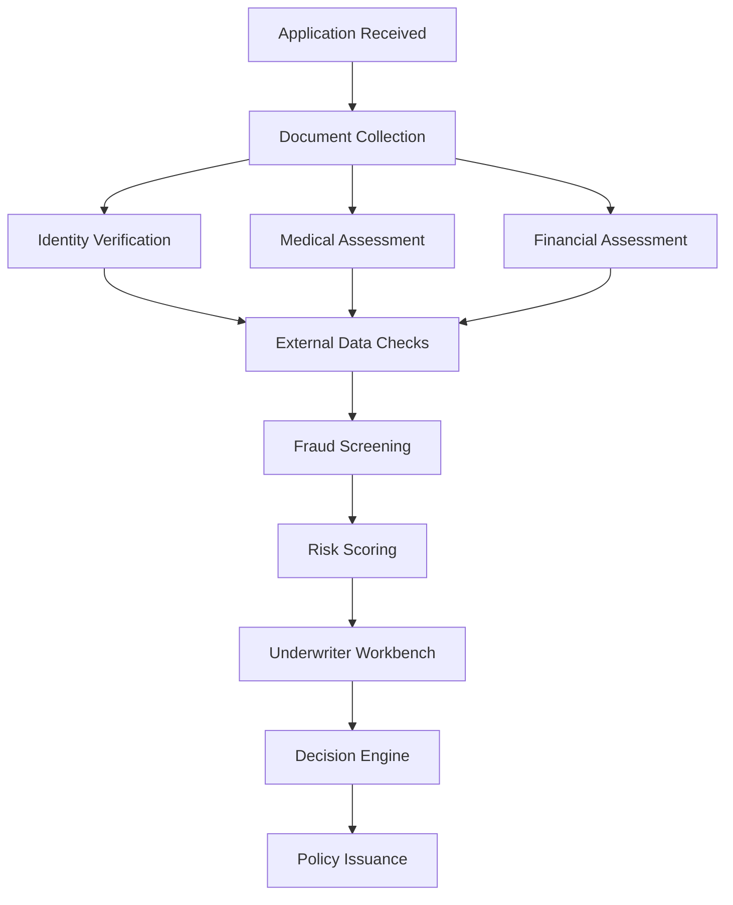

**Business Problem:
Underwriters often spend significant time gathering information rather than making decisions.**

Data exists across:
Applications
Medical records
Financial records
Customer history
Third-party sources

but is rarely consolidated.

Walkthrough

Step 1
Application enters the platform.

Step 2
Documents are collected and verified.

Step 3
Medical and financial risk factors are evaluated.

Step 4
Fraud screening is performed.

Step 5
A risk score is generated.

Step 6
The underwriter receives a consolidated view.

Step 7
The decision engine supports policy issuance.

AI Contribution:
Extract information from documents
Identify inconsistencies
Predict risk
Recommend decisions

Business Outcome:
Faster underwriting
Improved consistency
Lower operational cost
Better risk selection

