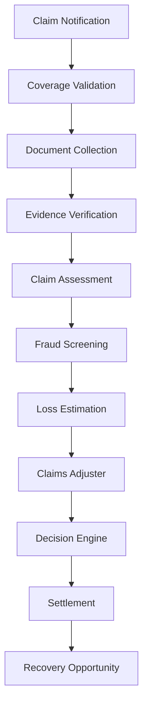

Business Problem: 

Claims are where insurers either deliver customer value or lose money. Many claims processes remain heavily manual.

Walkthrough

Step 1

Claim is reported.

Step 2

Coverage validation occurs automatically.

Step 3

Supporting evidence is collected.

Step 4

Claim severity is assessed.

Step 5

Fraud checks are performed.

Step 6

Adjusters review the case.

Step 7

Settlement decisions are made.

AI Contribution:
Reviewing documents
Detecting anomalies
Prioritizing high-risk claims
Recommending actions

Business Outcome:
Faster settlements
Better customer experience
Reduced claims leakage
Lower operating costs

