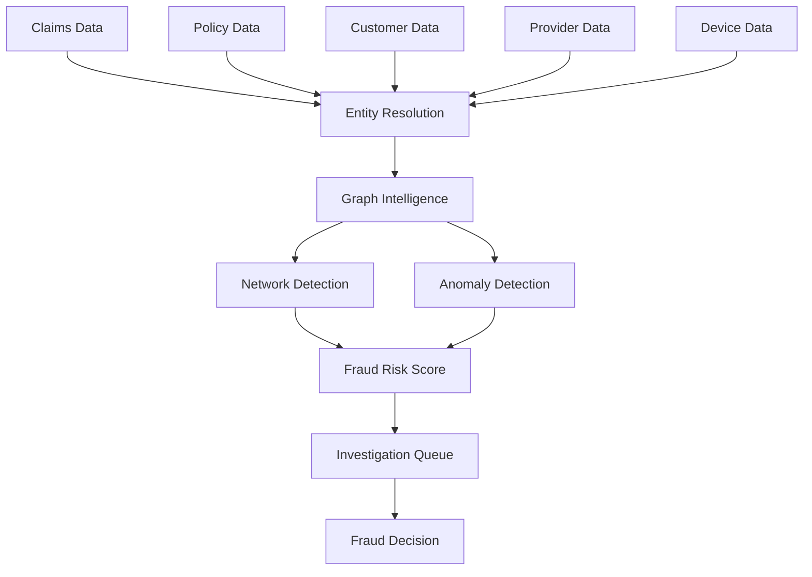

Business Problem:

Fraud is rarely visible when reviewing a single claim.

Fraud often appears only when relationships are analyzed across:

Policies
Claims
Customers
Providers
Devices
Bank accounts
Walkthrough

Step 1

Data from multiple systems enters Anaira.

Step 2

Entity resolution identifies the same real-world entities.

Step 3

Graph intelligence maps relationships.

Step 4

Suspicious networks are detected.

Step 5

Risk scores are generated.

Step 6

Investigators receive prioritized cases.

AI Contribution:
Fraud rings
Synthetic identities
Collusive networks
Emerging fraud patterns

Business Outcome:
Reduced fraud losses
Better investigation efficiency
Improved detection rates

