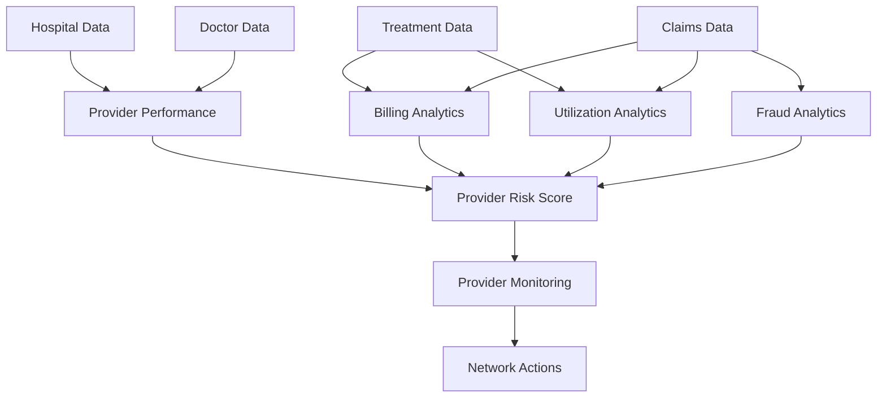

Business Problem

Insurers often lack visibility into provider behavior.

Examples:
Overbilling
Unnecessary procedures
Abnormal utilization patterns
Duplicate claims
Walkthrough

Step 1

Provider and treatment data are collected.

Step 2

Billing patterns are analyzed.

Step 3

Utilization trends are evaluated.

Step 4

Provider risk scores are calculated.

Step 5

Continuous monitoring occurs.

AI Contribution:
Billing anomalies
Emerging provider risks
Suspicious treatment patterns

Business Outcome:
Reduced medical leakage
Better provider governance
Improved network quality

