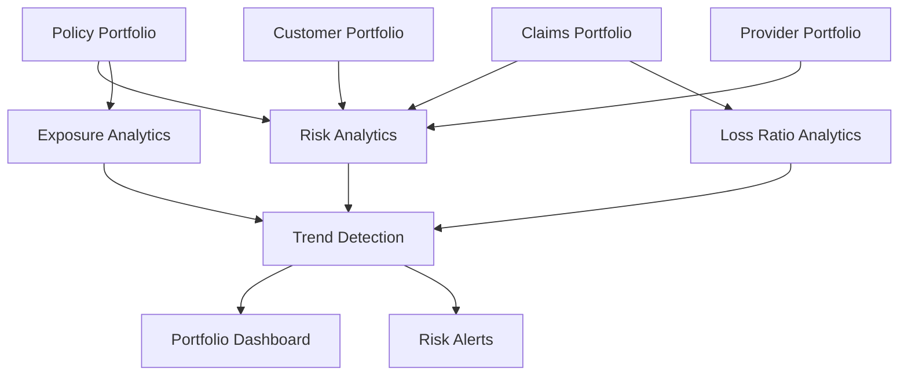

Business Problem

Risk does not exist only at the claim level.

Executives need visibility across:

Product lines
Regions
Providers
Customer segments
Walkthrough

Step 1

Portfolio data is aggregated.

Step 2

Exposure and loss metrics are calculated.

Step 3

Trends are analyzed.

Step 4

Alerts are generated.

Step 5

Leadership dashboards are updated.

AI Contribution

AI identifies:
Emerging risks
Deteriorating portfolios
Unexpected loss patterns

Business Outcome:
Earlier intervention
Better portfolio performance
Improved capital efficiency

