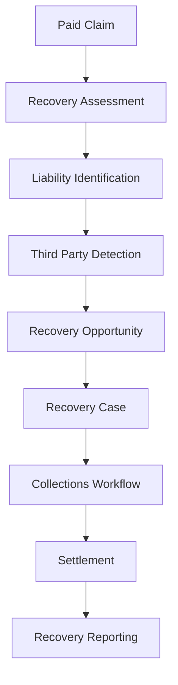

Business Problem:

Many insurers pay valid claims but fail to recover money from responsible third parties.

Walkthrough

Step 1

Paid claims are analyzed.

Step 2

Liability opportunities are identified.

Step 3

Recovery cases are created.

Step 4

Collections workflows are initiated.

Step 5

Recoveries are tracked.

AI identifies:
Missed recovery opportunities
Third-party liability patterns
High-probability recovery cases

Business Outcome:
Increased recoveries
Improved profitability
Better claims economics

