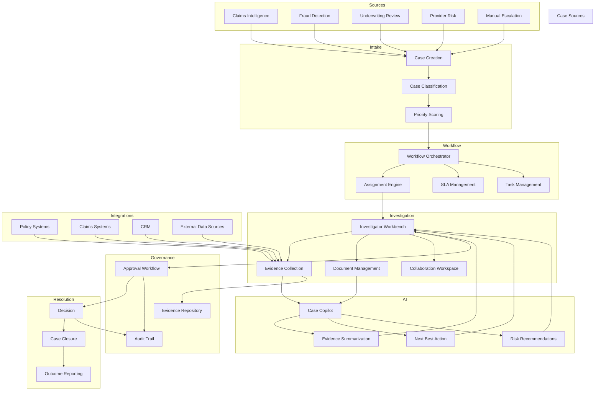

Business Problem: "Complex risk cases require human judgment."

Not every decision should be fully automated.

Walkthrough

Step 1

Cases are created.

Step 2

Work is assigned.

Step 3

Evidence is gathered.

Step 4

Teams collaborate.

Step 5

Decisions are documented.

Step 6

Cases are closed.

AI Contribution

AI assists investigators by:
Summarizing evidence
Recommending next actions
Drafting investigation notes

Business Outcome:

Faster investigations
Better consistency
Reduced manual effort

