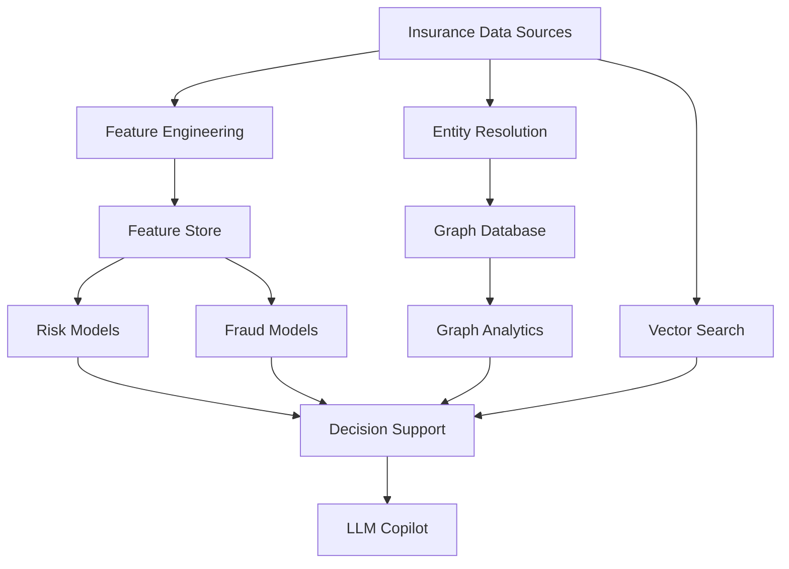

Business Problem

"Insurance data is fragmented across systems."

Traditional analytics struggles to understand relationships.

Walkthrough

The AI platform serves every module.

It provides:

Risk models
Fraud models
Entity resolution
Graph intelligence
AI copilots
Key Differentiator

"Rather than evaluating isolated records, Anaira evaluates relationships between people, policies, providers, claims, devices, and transactions."

This is where significant risk insights emerge.

