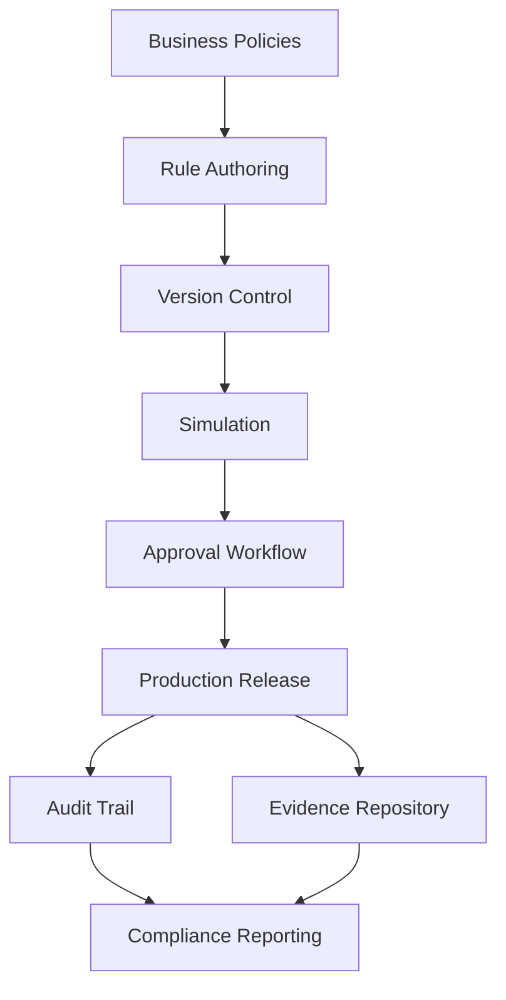

Business Problem

"Insurance decisions must be explainable, auditable, and compliant."

Walkthrough

Step 1

Policies are defined.

Step 2

Rules are version controlled.

Step 3

Changes are simulated.

Step 4

Approvals are obtained.

Step 5

Rules are deployed.

Step 6

Every decision is audited.

Business Outcome
Regulatory compliance
Explainable AI
Operational accountability
Reduced audit risk

