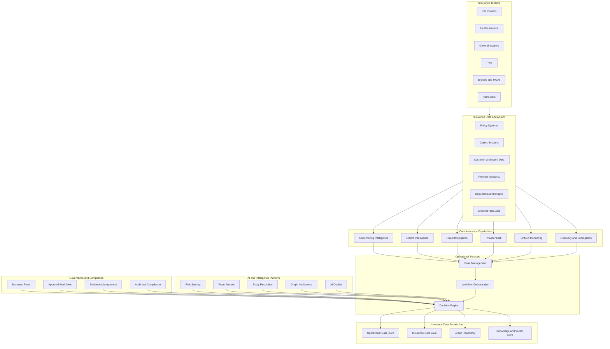

```mermaid
flowchart TB

subgraph T[Insurance Tenants]
    T1[Life Insurers]
    T2[Health Insurers]
    T3[General Insurers]
    T4[TPAs]
    T5[Brokers and MGAs]
    T6[Reinsurers]
end

subgraph S[Insurance Data Ecosystem]
    S1[Policy Systems]
    S2[Claims Systems]
    S3[Customer and Agent Data]
    S4[Provider Networks]
    S5[Documents and Images]
    S6[External Risk Data]
end

subgraph R[Core Insurance Capabilities]
    U[Underwriting Intelligence]
    C[Claims Intelligence]
    F[Fraud Intelligence]
    P[Provider Risk]
    M[Portfolio Monitoring]
    RS[Recovery and Subrogation]
end

subgraph O[Operational Services]
    W[Case Management]
    WF[Workflow Orchestration]
    D[Decision Engine]
end

subgraph AI[AI and Intelligence Platform]
    A1[Risk Scoring]
    A2[Fraud Models]
    A3[Entity Resolution]
    A4[Graph Intelligence]
    A5[AI Copilot]
end

subgraph G[Governance and Compliance]
    G1[Business Rules]
    G2[Approval Workflows]
    G3[Evidence Management]
    G4[Audit and Compliance]
end

subgraph DP[Insurance Data Foundation]
    D1[Operational Data Store]
    D2[Insurance Data Lake]
    D3[Graph Repository]
    D4[Knowledge and Vector Store]
end

T --> S

S --> U
S --> C
S --> F
S --> P
S --> M
S --> RS

U --> W
C --> W
F --> W
P --> W
M --> W
RS --> W

W --> WF
WF --> D

A1 --> D
A2 --> D
A3 --> D
A4 --> D
A5 --> D

G1 --> D
G2 --> D
G3 --> D
G4 --> D

D --> D1
D --> D2
D --> D3
D --> D4
```
