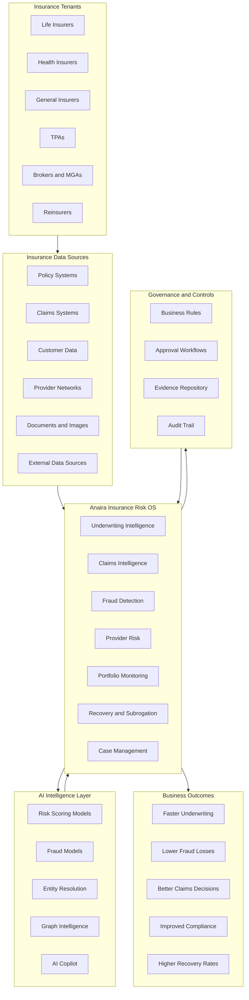

```mermaid
flowchart TB

subgraph T[Insurance Tenants]
    T1[Life Insurers]
    T2[Health Insurers]
    T3[General Insurers]
    T4[TPAs]
    T5[Brokers and MGAs]
    T6[Reinsurers]
end

subgraph S[Insurance Data Sources]
    S1[Policy Systems]
    S2[Claims Systems]
    S3[Customer Data]
    S4[Provider Networks]
    S5[Documents and Images]
    S6[External Data Sources]
end

subgraph A[Anaira Insurance Risk OS]
    A1[Underwriting Intelligence]
    A2[Claims Intelligence]
    A3[Fraud Detection]
    A4[Provider Risk]
    A5[Portfolio Monitoring]
    A6[Recovery and Subrogation]
    A7[Case Management]
end

subgraph AI[AI Intelligence Layer]
    AI1[Risk Scoring Models]
    AI2[Fraud Models]
    AI3[Entity Resolution]
    AI4[Graph Intelligence]
    AI5[AI Copilot]
end

subgraph G[Governance and Controls]
    G1[Business Rules]
    G2[Approval Workflows]
    G3[Evidence Repository]
    G4[Audit Trail]
end

subgraph O[Business Outcomes]
    O1[Faster Underwriting]
    O2[Lower Fraud Losses]
    O3[Better Claims Decisions]
    O4[Improved Compliance]
    O5[Higher Recovery Rates]
end

T --> S
S --> A

AI --> A
A --> AI

G --> A
A --> G

A --> O
```
