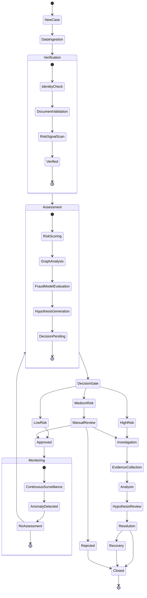

```mermaid
stateDiagram-v2

    [*] --> NewCase

    NewCase --> DataIngestion
    DataIngestion --> Verification

    state Verification {
        [*] --> IdentityCheck
        IdentityCheck --> DocumentValidation
        DocumentValidation --> RiskSignalScan
        RiskSignalScan --> Verified
        Verified --> [*]
    }

    Verification --> Assessment

    state Assessment {
        [*] --> RiskScoring
        RiskScoring --> GraphAnalysis
        GraphAnalysis --> FraudModelEvaluation
        FraudModelEvaluation --> HypothesisGeneration
        HypothesisGeneration --> DecisionPending
        DecisionPending --> [*]
    }

    Assessment --> DecisionGate

    DecisionGate --> LowRisk
    DecisionGate --> MediumRisk
    DecisionGate --> HighRisk

    LowRisk --> Approved

    MediumRisk --> ManualReview

    HighRisk --> Investigation

    ManualReview --> Approved
    ManualReview --> Rejected
    ManualReview --> Investigation

    Investigation --> EvidenceCollection
    EvidenceCollection --> Analysis
    Analysis --> HypothesisReview
    HypothesisReview --> Resolution

    Approved --> Monitoring

    state Monitoring {
        [*] --> ContinuousSurveillance
        ContinuousSurveillance --> AnomalyDetected
        AnomalyDetected --> ReAssessment
        ReAssessment --> [*]
    }

    ReAssessment --> Assessment

    Resolution --> Recovery
    Resolution --> Closed

    Recovery --> Closed

    Rejected --> Closed

    Closed --> [*]
```
