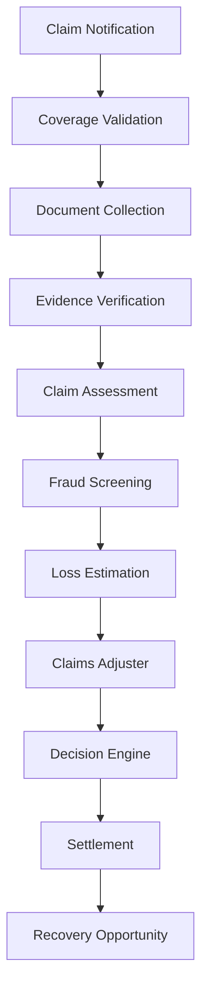

```mermaid
flowchart TB

A[Claim Notification]

B[Coverage Validation]

C[Document Collection]

D[Evidence Verification]

E[Claim Assessment]

F[Fraud Screening]

G[Loss Estimation]

H[Claims Adjuster]

I[Decision Engine]

J[Settlement]

K[Recovery Opportunity]

A --> B
B --> C
C --> D

D --> E
E --> F
F --> G

G --> H
H --> I

I --> J
J --> K
```
