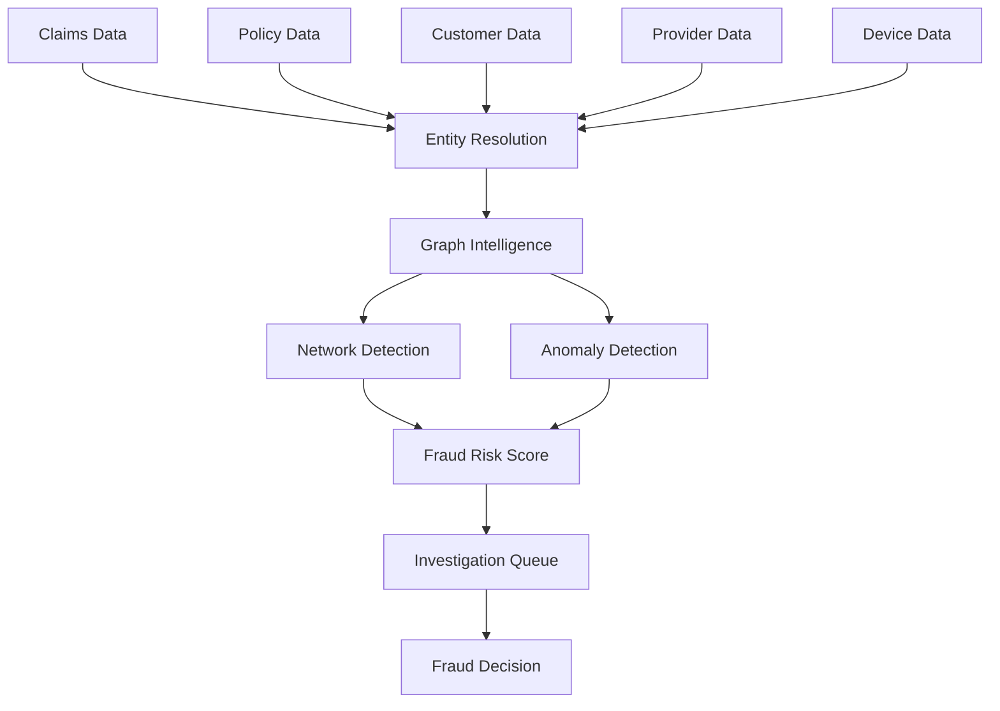

```mermaid
flowchart TB

A[Claims Data]

B[Policy Data]

C[Customer Data]

D[Provider Data]

E[Device Data]

F[Entity Resolution]

G[Graph Intelligence]

H[Network Detection]

I[Anomaly Detection]

J[Fraud Risk Score]

K[Investigation Queue]

L[Fraud Decision]

A --> F
B --> F
C --> F
D --> F
E --> F

F --> G

G --> H
G --> I

H --> J
I --> J

J --> K
K --> L
```
