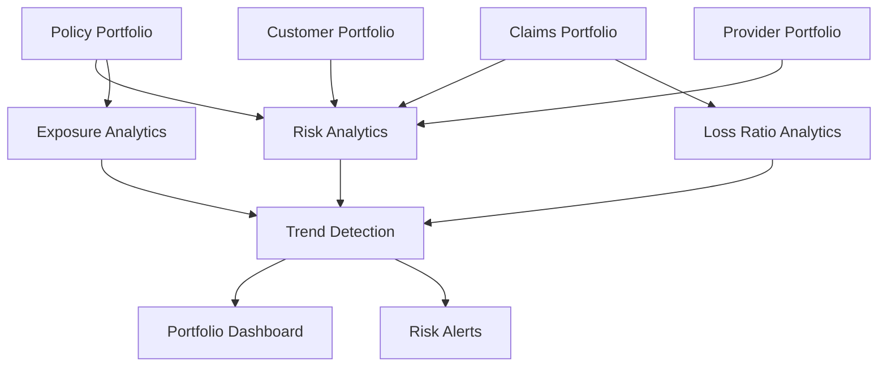

```mermaid
flowchart TB

A[Policy Portfolio]

B[Claims Portfolio]

C[Customer Portfolio]

D[Provider Portfolio]

E[Risk Analytics]

F[Exposure Analytics]

G[Loss Ratio Analytics]

H[Trend Detection]

I[Portfolio Dashboard]

J[Risk Alerts]

A --> E
B --> E
C --> E
D --> E

A --> F
B --> G

E --> H
F --> H
G --> H

H --> I
H --> J
```
