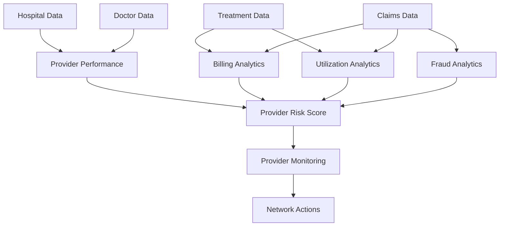

```mermaid
flowchart TB

A[Hospital Data]

B[Doctor Data]

C[Treatment Data]

D[Claims Data]

E[Provider Performance]

F[Billing Analytics]

G[Utilization Analytics]

H[Fraud Analytics]

I[Provider Risk Score]

J[Provider Monitoring]

K[Network Actions]

A --> E
B --> E

C --> F
D --> F

C --> G
D --> G

D --> H

E --> I
F --> I
G --> I
H --> I

I --> J
J --> K
```
