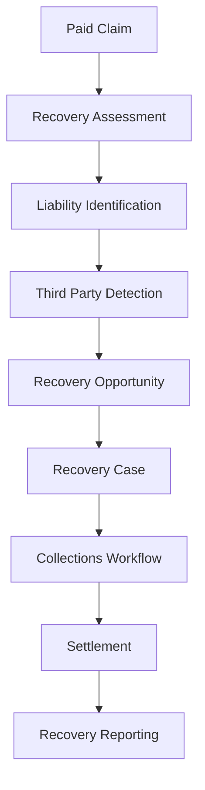

```mermaid
flowchart TB

A[Paid Claim]

B[Recovery Assessment]

C[Liability Identification]

D[Third Party Detection]

E[Recovery Opportunity]

F[Recovery Case]

G[Collections Workflow]

H[Settlement]

I[Recovery Reporting]

A --> B
B --> C

C --> D
D --> E

E --> F
F --> G

G --> H
H --> I
```
