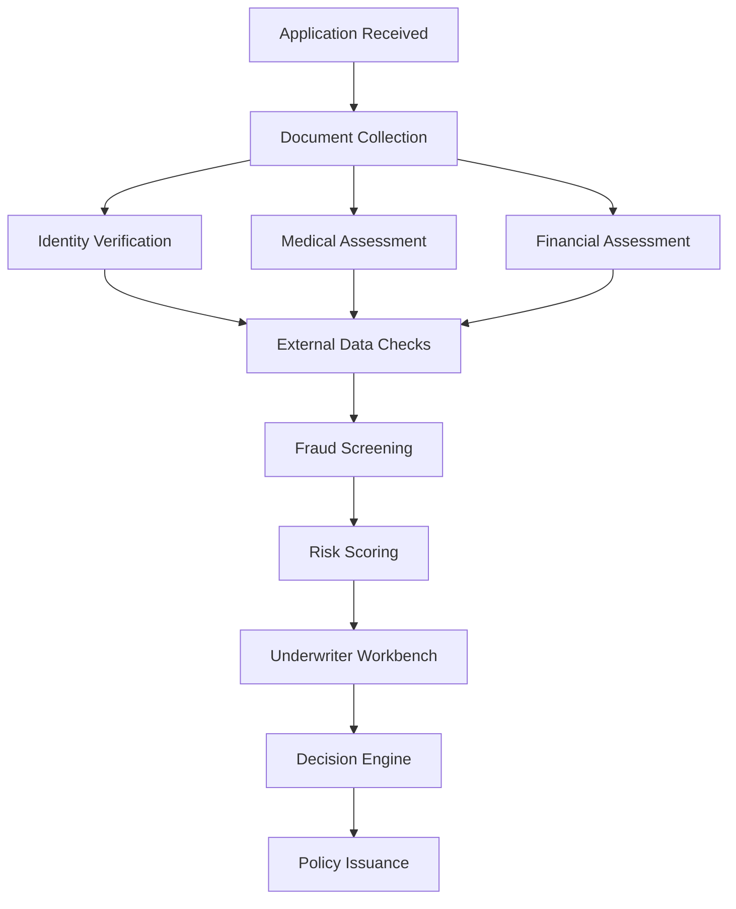

```mermaid
flowchart TB

A[Application Received]

B[Document Collection]

C[Identity Verification]

D[Medical Assessment]

E[Financial Assessment]

F[External Data Checks]

G[Fraud Screening]

H[Risk Scoring]

I[Underwriter Workbench]

J[Decision Engine]

K[Policy Issuance]

A --> B
B --> C
B --> D
B --> E

C --> F
D --> F
E --> F

F --> G
G --> H
H --> I

I --> J
J --> K
```
